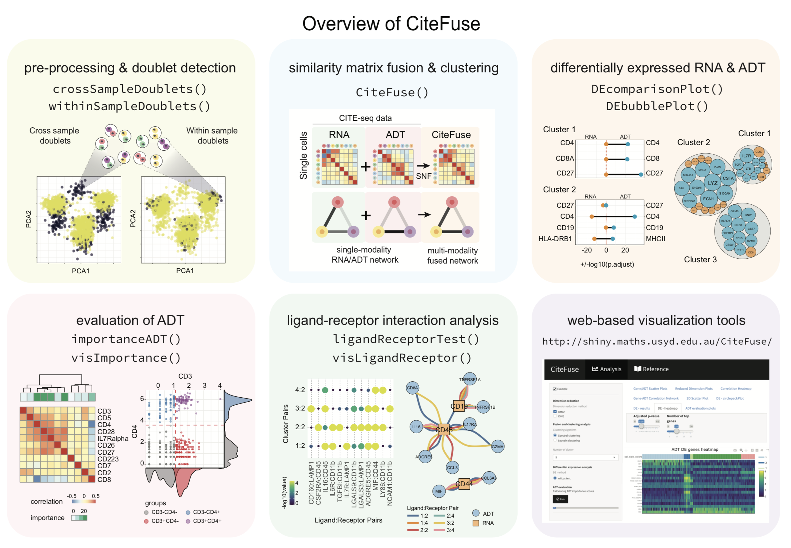

# CiteFuse


CiteFuse is a streamlined package consisting of a suite of tools for pre-processing, modality integration, clustering, differential RNA and ADT expression analysis, ADT evaluation, ligand-receptor interaction analysis, and interactive web-based visualization of CITE-seq data


## Installation

Install CiteFuse required Bioconductor 3.10

```r
library(BiocManager)
install(version = "3.10")
```


```r
BiocManager::install("")
```

```r
library(devtools)
devtools::install_github("SydneyBioX/CiteFuse")
```

## Vignette

You can find the vignette at our webiste: https://sydneybiox.github.io/CiteFuse/index.html.


## CiteFuse overview




